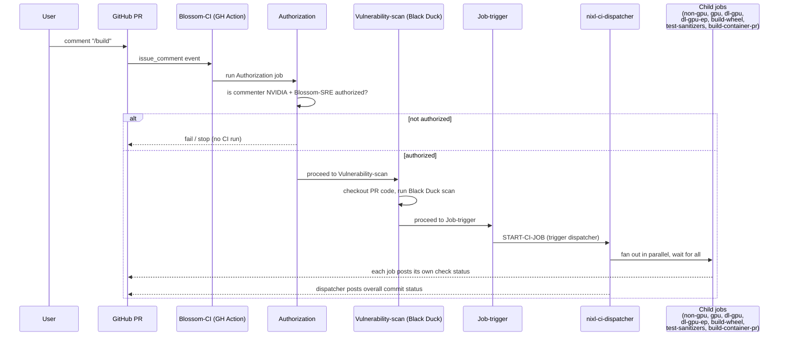

# NIXL CI Overview

This document catalogs every CI job in the NIXL repository — GitHub Actions
workflows (`.github/workflows/`) and Jenkins jobs triggered through
Blossom-CI (`.ci/jenkins/`) — and states whether each one runs
**automatically on every PR**, or is a **standalone/manual** job that only
runs on-demand (`workflow_dispatch`, a PR comment, or a cron schedule).

## Quick reference

| Job | System | Trigger | Automatic on every PR? |
|---|---|---|---|
| [NVIDIA NIXL Validation](#nvidia-nixl-validation-build_validationyml) (`mirror_repo`, `trigger-ci`) | GitHub Actions | `push` to `main` / `pull-request/<n>` | Yes |
| [AWS NIXL Validation](#aws-nixl-validation-aws_efa_validationyml) | GitHub Actions | `push` to `main` / `pull-request/<n>` | Yes |
| [Clang Format Check](#clang-format-check-clang-formatyml) | GitHub Actions | `pull_request` | Yes |
| [Copyright Checks](#copyright-checks-copyright-checksyml) | GitHub Actions | `pull_request` | Yes |
| [PR Size Check](#pr-size-check-pr-size-checkyml) | GitHub Actions | `pull_request` | Yes |
| [Python Checks](#python-checks-python-checksyml) | GitHub Actions | `pull_request` | Yes |
| [Run Pre-Commit Hooks](#run-pre-commit-hooks-pre-commityml) | GitHub Actions | `push`, `pull_request` | Yes |
| [Claude Code Review](#claude-code-review-claude-reviewyml) | GitHub Actions | `pull_request` (opened/synchronize/reopened) | Yes |
| [External Contributor](#external-contributor-external_contributoryaml) | GitHub Actions | `pull_request_target` (opened, fork only) | Yes (fork PRs only) |
| [Blossom-CI](#blossom-ci-blossom-ciyml) | GitHub Actions | `/build` PR comment, or `workflow_dispatch` | No — manual |
| `nixl-ci-dispatcher` → `non-gpu`, `gpu`, `dl-gpu`, `dl-gpu-ep`, `build-wheel`, `test-sanitizers`, `build-container-pr` | Jenkins (dispatcher-triggered) | Fan-out from Blossom-CI `Job-trigger` | No — only after `/build`, but these 7 are the *only* Jenkins jobs in the PR CI path |
| `nixl-ci-build-container` | Jenkins (standalone) | Nightly cron + manual | No — never runs as part of PR CI |
| `nixl-ci-build-wheel-nightly` | Jenkins (standalone) | Nightly cron + manual | No — never runs as part of PR CI |
| `nixl-ci-build-llm-container` | Jenkins (standalone) | Manual only | No — never runs as part of PR CI |
| `nixl-ci-test-llm-container` | Jenkins (standalone) | Manual, or chained from `build-llm-container` via `RUN_TEST` | No — never runs as part of PR CI |
| `nixl-ci-cleanup-artifacts` | Jenkins (standalone) | Daily cron (6 AM) + manual | No — never runs as part of PR CI |
| `nixl-ci-nightly` | Jenkins (standalone) | Nightly cron (`H 0`) + manual | No — orchestrates the nightly UCX-`master` run of the 3 GPU jobs |

> **Note on Jenkins jobs:** `proj-jjb.yaml` defines 14 Jenkins jobs: the
> dispatcher, the 7 jobs it fans out to (the PR CI flow), and 6 standalone jobs
> (`build-container`, `build-wheel-nightly`, `build-llm-container`,
> `test-llm-container`, `cleanup-artifacts`, `nightly`). The standalone ones run only on a
> nightly/daily cron or when someone triggers them manually from the Jenkins UI,
> and are never invoked by the dispatcher or by a PR event.

## GitHub Actions workflows

All files below live in `.github/workflows/`.

### NVIDIA NIXL Validation (`build_validation.yml`)
- **Trigger:** `push` to `main` or to a `pull-request/<n>` ref (GitHub auto-creates this ref for open PRs).
- **What it does:** `mirror_repo` syncs the repo to an internal GitLab mirror; `trigger-ci` then POSTs to a GitLab pipeline (`PIPELINE_URL`) using the same ref, kicking off the internal GitLab CI pipeline.
- **Automatic on every PR:** Yes — this is the trigger that starts the internal GitLab-side pipeline for every push/PR update.

### AWS NIXL Validation (`aws_efa_validation.yml`)
- **Trigger:** same as above — `push` to `main` / `pull-request/<n>`.
- **What it does:** Runs the AWS EFA validation test suite (`run_aws_tests`) against AWS infrastructure.
- **Automatic on every PR:** Yes.

### Clang Format Check (`clang-format.yml`)
- **Trigger:** `pull_request`.
- **What it does:** Runs `clang-format-19` over the C/C++ lines changed in the PR (excluding `examples/device/ep`) and fails on formatting violations.
- **Automatic on every PR:** Yes.

### Copyright Checks (`copyright-checks.yml`)
- **Trigger:** `pull_request`.
- **What it does:** Runs `.github/workflows/copyright-check.sh` inside the `dynamo/helm-tester` container to verify SPDX/copyright headers.
- **Automatic on every PR:** Yes.

### PR Size Check (`pr-size-check.yml`)
- **Trigger:** `pull_request`.
- **What it does:** Fails the PR if it changes more than 500 lines (excluding `subprojects/*`).
- **Automatic on every PR:** Yes.

### Python Checks (`python-checks.yml`)
- **Trigger:** `pull_request`.
- **What it does:** Runs `.ci/scripts/check_prints.sh` against `./src`, `./test`, `./benchmark`, `./examples/python` to flag stray `print()` calls.
- **Automatic on every PR:** Yes.

### Run Pre-Commit Hooks (`pre-commit.yml`)
- **Trigger:** `push`, `pull_request`.
- **What it does:** Runs the repo's configured `pre-commit` hooks against files modified in the PR/push.
- **Automatic on every PR:** Yes.

### Claude Code Review (`claude-review.yml`)
- **Trigger:** `pull_request` (`opened`, `synchronize`, `reopened`).
- **What it does:** Generates the PR diff and runs an automated Claude-based code review, posting results as PR feedback.
- **Automatic on every PR:** Yes.

### External Contributor (`external_contributor.yaml`)
- **Trigger:** `pull_request_target`, `opened`.
- **What it does:** Posts a reminder comment, only `if` the PR's head repo differs from the base repo (i.e., a fork PR).
- **Automatic on every PR:** Only fires for PRs from forks — a no-op job condition otherwise.

### Blossom-CI (`blossom-ci.yml`)
- **Trigger:** `issue_comment` (only proceeds `if` the comment body is exactly `/build`), or manual `workflow_dispatch`.
- **What it does:** `Authorization` validates the commenter is authorized; `Vulnerability-scan` checks out the PR code and runs the Blossom vulnerability scan action; `Job-trigger` calls `blossom-ci` with `OPERATION: START-CI-JOB`, which kicks off the Jenkins `nixl-ci-dispatcher` job (see below); `Upload-Log` (on `workflow_dispatch` only) links the Jenkins build log back to the PR.
- **Automatic on every PR:** **No.** This is a maintainer-gated, manual step — someone with commit access must comment `/build` on the PR to start the full Jenkins pipeline.

#### Blossom-CI flow



Step by step, matching the jobs in `blossom-ci.yml`:

1. A user comments `/build` on the PR.
2. The `Blossom-CI` GitHub Action wakes up on the `issue_comment` event.
3. **Authorization** checks the commenter is allowed to trigger CI: non-NVIDIA
   users cannot trigger it at all, and NVIDIA employees need prior
   authorization from the Blossom SRE team. Unauthorized comments stop here.
4. **Vulnerability-scan** checks out the PR's code and runs a Black
   Duck-based vulnerability scan via the `NVIDIA/blossom-action`.
5. **Job-trigger** calls `blossom-ci` with `OPERATION: START-CI-JOB`, which
   triggers the Jenkins `nixl-ci-dispatcher` job.
6. `nixl-ci-dispatcher` fans out in parallel to its seven child jobs
   (`non-gpu`, `gpu`, `dl-gpu`, `dl-gpu-ep`, `build-wheel`,
   `test-sanitizers`, `build-container-pr` — see [Jenkins jobs](#jenkins-jobs) below).
7. Each child job reports its own status back as an individual GitHub PR
   check, so the PR shows per-job pass/fail rather than one aggregate check.

## Jenkins jobs

All 14 Jenkins jobs are defined in `.ci/jenkins/pipeline/proj-jjb.yaml`
(Jenkins Job Builder config). The dispatcher runs its own pipeline,
`.ci/jenkins/pipeline/Jenkinsfile.dispatcher`, checked out from the PR merge
ref (`refs/pull/<n>/merge`) on webhook runs, or from any branch/commit passed
in `sha1` on manual runs; all other jobs run through the shared pipeline
entry point `.ci/jenkins/pipeline/Jenkinsfile`. None of them run directly off GitHub
events — they only start via the Jenkins webhook fired by Blossom-CI, or via
their own nightly/manual trigger. They split into two groups:

- **Dispatcher-triggered (part of the PR CI path):** `nixl-ci-dispatcher` and
  the 7 jobs it fans out to. This is the *only* way any Jenkins job runs
  against a PR, and only after a `/build` comment.
- **Standalone (never run against a PR):** `nixl-ci-build-container`,
  `nixl-ci-build-wheel-nightly`, `nixl-ci-build-llm-container`,
  `nixl-ci-test-llm-container`, `nixl-ci-cleanup-artifacts`, `nixl-ci-nightly` —
  each has its own nightly cron and/or manual trigger and is invoked
  independently of PRs and of the dispatcher.

### `nixl-ci-dispatcher` (dispatcher-triggered)

- **Trigger:** GitHub webhook payload forwarded by Blossom-CI's `Job-trigger` step (`OPERATION: START-CI-JOB`). Not a raw GitHub Actions event.
- **What it does:** Fans out in parallel to seven downstream Jenkins jobs, waiting on all of them:
  - `nixl-ci-non-gpu` — `.ci/jenkins/lib/build-matrix.yaml`
  - `nixl-ci-gpu` — `.ci/jenkins/lib/test-matrix.yaml`
  - `nixl-ci-dl-gpu` — `.ci/jenkins/lib/test-dl-matrix.yaml` (dlcluster.nvidia.com)
  - `nixl-ci-dl-gpu-ep` — `.ci/jenkins/lib/test-dl-ep-matrix.yaml` (nixl_ep elastic tests on dlcluster.nvidia.com)
  - `nixl-ci-build-wheel` — `.ci/jenkins/lib/build-wheel-matrix.yaml`
  - `nixl-ci-test-sanitizers` — `.ci/jenkins/lib/test-sanitizer-matrix.yaml` (ASan/UBSan + TSan)
  - `nixl-ci-build-container-pr` — `.ci/jenkins/lib/build-container-pr-matrix.yaml`
- **UCX version:** The three GPU test jobs (`nixl-ci-gpu`, `nixl-ci-dl-gpu`, `nixl-ci-dl-gpu-ep`) build and test against a single UCX version per run — the `UCX_VER` parameter, which defaults to empty and falls back to the `Dockerfile` `ARG UCX_VERSION` default (`v1.22.x`). UCX `master` is validated nightly, not per PR: the standalone `nixl-ci-nightly` job (see below) fans out to all three with `UCX_VER=master` and emails one consolidated report, so UCX regressions surface outside the PR path instead of blocking PRs.
- **Automatic on every PR:** No — only runs after a `/build` comment triggers Blossom-CI. The dispatcher also aborts any stale in-flight dispatcher run for the same PR (and the leaf builds it started) before starting.

### `nixl-ci-build-container-pr` (dispatcher-triggered)

- **Trigger:** Fan-out from `nixl-ci-dispatcher` (same as the other PR CI jobs).
- **What it does:** Build-only verification (no push) of the `nixl` (EP + debug) and `nixlbench` container images — one matrix cell per target/arch (x86_64 and aarch64), all in parallel. It runs the same `contrib/build-container.sh` / `benchmark/nixlbench/contrib/build.sh` the standalone `nixl-ci-build-container` job runs, so container/packaging breakage (e.g. a missing `--torch-versions`, or an EP nvlink register-count failure) is caught on the PR instead of only by the nightly job. Like the other leaf jobs it runs whenever the dispatcher fans out.
- **Automatic on every PR:** No — only after a `/build` comment (like the other dispatcher jobs).

### `nixl-ci-build-wheel` (dispatcher-triggered)
- **Config:** `.ci/jenkins/lib/build-wheel-matrix.yaml`
- **What it does:** Builds NIXL Python wheels for each Python version × architecture combination. Uses a two-stage `contrib/Dockerfile.manylinux` build: the `wheel_base` stage (all slow deps: UCX, gRPC, Rust, etc.) is pre-built and cached in Artifactory under `CI_IMAGE_TAG`; PR builds pull this pre-built image and run only the `wheel` stage (~16 steps). PR builds also pass `--torch-versions` (set via the `TORCH_VERSIONS` env in the matrix file) to limit the torch extension builds to the latest version. x86_64 wheels build in the `manylinux` (podman-in-container) runner.
- **vLLM/SGLang NIXL sanity (aarch64):** the same job also gates a 1-prefill/1-decode NIXL KV-transfer sanity for vLLM and SGLang. Each framework runs as its own aarch64 branch (`build_helper_vllm` / `build_helper_sglang`): build the aarch64 wheels (reusing the cached `wheel_base`), layer them onto the pinned framework base image (`.ci/dockerfiles/Dockerfile.{vllm,sglang}-base`, built as `category: tool` by ci-demo), then run the sanity on the `gb200nvl72_ci` dlcluster SLURM partition over SSH (`.gitlab/test_vllm_sglang_sanity.sh`). SGLang additionally asserts a gsm8k accuracy floor on `Qwen/Qwen3-8B`. The aarch64 wheels are built once per framework branch (duplicated) so the two flows stay separate, labeled branches in the Jenkins UI. The sanity model is prefetched through the internal HuggingFace mirror in `SANITY_HF_ENDPOINT` rather than `huggingface.co` (which rate-limits the shared CI egress IP); each sanity step passes it into the SLURM container as `HF_ENDPOINT`.
- **`CI_IMAGE_TAG`:** Same convention as the other five matrix files (also tags `build_helper_*` and the sanity `*-nixl-base` images). `contrib/Dockerfile.manylinux` is part of the `CI_FILES` list in `cidemo-init.sh`, so changing it (or any other CI file) automatically derives a new `CI_IMAGE_TAG` and rebuilds the cached `wheel_base` image (see [CI_IMAGE_TAG management](#ci_image_tag-management)).

### `nixl-ci-build-container` (standalone)
- **Trigger:** Nightly cron (builds `nixlbench` and `nixl` targets, on both the default CUDA base image and the DLFW PyTorch daily image, ~3–4 AM), or manual run with parameters (`BUILD_TARGET`, `NIXL_VERSION`, `UCX_VERSION`, base image overrides, etc.).
- **What it does:** Builds and pushes x86_64/aarch64 NIXL/NIXLBench container images to Artifactory, then sets build metadata properties on each image via the Artifactory REST API. The Push step runs with `set -eo pipefail` so auth or API failures abort the build immediately. `BUILD_UCX_SPCX_PLUGIN` (default on, `nixl` target only) builds the internal UCX spcx plugin against the image's UCX and installs it into the UCX plugin dir; it needs the `svc-nixl-gitlab-token` + `ucx-plugin-gitlab-url` credentials, bound on the Build NIXL step. `BUILD_NIXL_EP` is on by default and has no off-switch — `contrib/build-container.sh` builds EP regardless. `BUILD_INFINIA` (default off, `nixl` target only) stages the DDN libs from harbor.mellanox.com and builds `libplugin_INFINIA.so` into the image; it is off by default because it adds an external registry dependency.
- **Image tag:** `pipeline_start` resolves the NIXL and UCX commits once (`NIXL_SHA`, `UCX_SHA`) and exports `IMAGE_TAG_BASE`; both arches build from those exact commits and tag from that base, and `pipeline_stop` reuses it to name the images. Previously each arch re-resolved UCX independently, so a branch moving mid-build could ship two arches from different UCX commits under one tag.
- **Completion mail:** When `MAIL_TO` is set, `pipeline_stop` mails the build result, listing the pushed image URLs (and the `-latest` tags when `UPDATE_LATEST`) so the verification team can pull them directly. The list is included only on `SUCCESS` — a failed run may not have pushed, and a link to a missing image is worse than no link.
- **Automatic on every PR:** No — standalone/nightly + manual only.

### `nixl-ci-build-wheel-nightly` (standalone)
- **Trigger:** Nightly cron (two runs, CUDA 13 and CUDA 12 base images, from `main`), or manual run from any branch/tag/PR ref/SHA.
- **What it does:** Reuses the per-PR wheel build path (`contrib/build-container.sh` + `Dockerfile.manylinux`), adds UCX wiring, and publishes verification wheels to Artifactory.
- **Automatic on every PR:** No — standalone/nightly + manual only.

### `nixl-ci-build-llm-container` (standalone)
- **Trigger:** Manual only (no cron, no webhook).
- **What it does:** Builds the 4 LLM inference container variants (`vllm-nixl`, `vllm-cu12-nixl`, `sglang-nixl`, `sglang-cu13-nixl`) for x86_64/aarch64 from a published NIXL wheel set, publishes multi-arch manifests, and optionally (`RUN_TEST`) fires `nixl-ci-test-llm-container` per built variant.
- **Automatic on every PR:** No — standalone/manual only, used for release verification.

### `nixl-ci-cleanup-artifacts` (standalone)
- **Trigger:** Daily cron at 6 AM, or manual run with optional `DRY_RUN=true` parameter.
- **What it does:** Deletes stale Artifactory artifacts based on `.ci/cleanup-spec.json` — PR Docker images older than 1 day, CI base images not pulled in 2 weeks, verification Docker images and PyPI wheels older than 3 months.
- **Matrix:** `.ci/jenkins/lib/cleanup-matrix.yaml`. Runs on an Ubuntu 24.04 container with `jf` and `jq` installed at runtime.
- **Automatic on every PR:** No — standalone/scheduled + manual only.

### `nixl-ci-test-llm-container` (standalone)
- **Trigger:** Manual, or chained asynchronously from `nixl-ci-build-llm-container` when `RUN_TEST` is enabled.
- **What it does:** Runs smoke/perf/accuracy tests for one published LLM inference container image on the `mizu` SLURM partition (2-GPU node); framework (vllm/sglang) is auto-detected from the image URL.
- **Automatic on every PR:** No — standalone/manual only.

### `nixl-ci-nightly` (standalone)

- **Trigger:** Nightly cron (`H 0 * * *`), or manual run (`UCX_REF`, `MAIL_TO` parameters).
- **What it does:** Fans out to `nixl-ci-gpu`, `nixl-ci-dl-gpu`, `nixl-ci-dl-gpu-ep` with `UCX_VER=${UCX_REF}` (default `master`), waits for all three, and emails one consolidated report to `MAIL_TO` (default `nixl-ci-alerts@exchange.nvidia.com`) **only when a leg fails** — a green night is silent. This is the single place nightly UCX-`master` results are collected and sent from; per-PR runs of the GPU jobs cover only the release UCX version.
- **Matrix:** `.ci/jenkins/lib/nightly-matrix.yaml` — a lightweight ci-demo orchestrator (one groovy step: fan out, wait, mail), no GPU of its own.
- **Automatic on every PR:** No — standalone/scheduled + manual only.

## Slurm job naming

Jobs submitted via the `slurmCI` module are named `${JOB_BASE_NAME}-${BUILD_NUMBER}`; jobs that run multiple parallel allocations within a build insert a `<variant>` before the build number to disambiguate:

| Pipeline | Slurm job name pattern |
|---|---|
| `nixl-ci-gpu` | `nixl-ci-gpu-<build>` |
| `nixl-ci-dl-gpu` | `nixl-ci-dl-gpu-<build>` |
| `nixl-ci-dl-gpu-ep` | `nixl-ci-dl-gpu-ep-<build>` |
| `nixl-ci-build-wheel` | `nixl-ci-build-wheel-<fw>-<build>` (`fw`: `vllm` or `sglang`) |
| `nixl-ci-test-llm-container` | `nixl-ci-test-llm-container-<build>` |

Use `squeue --name <pattern>` or `squeue -u <user>` to identify which pipeline owns a running job.

## How to trigger CI manually

- **Full Jenkins pipeline for a PR:** comment `/build` on the PR (requires authorization — see `Authorization` step in `blossom-ci.yml`).
- **Re-run a single Jenkins job with different parameters:** use `workflow_dispatch` on `blossom-ci.yml`, or trigger the Jenkins job directly if you have Jenkins access.
- **Container/wheel builds outside the nightly schedule:** run `nixl-ci-build-container` or `nixl-ci-build-wheel-nightly` manually from the Jenkins UI with custom parameters.

## CI_IMAGE_TAG management

`CI_IMAGE_TAG` is the Docker image tag used by all matrix jobs to identify the
base images they build and pull. It appears as `CI_IMAGE_TAG: "CI_MANAGED"` in
the six matrix YAML files — this placeholder is intentional and must not be
replaced with a static value.

At the start of every Jenkins run, `cidemo-init.sh` derives the real tag
automatically:

```bash
NEW_TAG=$(git log -1 --format=%h -- "${CI_FILES[@]}")
```

This returns the short git commit hash of the most recent commit that touched
any of the CI source files (`Dockerfile.base`, `Dockerfile.gpu-test`,
`Dockerfile.build_helper`, `build.sh`, `common.sh`, `Dockerfile.manylinux`). It
then patches all six YAML files in the Jenkins workspace with `sed` before the
matrix library reads them. No commit or push is made — the patch exists only in
the workspace.

**Caching behaviour:** the derived tag is stable as long as the CI source files
are unchanged. Two PRs that both leave the CI files untouched get the same tag
and share the cached Artifactory images. A PR that changes a Dockerfile gets a
new tag and triggers a rebuild automatically.

**You never need to manually update `CI_IMAGE_TAG`.** The `CI_MANAGED`
placeholder signals this clearly.

## Registry push retries

Transient `HTTP 503 Service Unavailable` responses from Artifactory were failing
otherwise-green builds at the push step, after the image had already built
successfully. Every image push now retries, but the mechanism differs because
`--retry` was only added in podman 5.0 and most push steps run on an older one.

**`build-container-matrix.yaml`** runs on `quay.io/podman/stable:v5.7.1` and uses
the native `--retry 5`. podman already retries this class of error —
`go.podman.io/common/pkg/retry` treats HTTP 502-504 and network errors as
retryable, while failing fast on unauthorized, denied and unknown
name/manifest, so a larger budget never delays a genuine failure. `--retry N`
counts retries *after* the initial push, and the backoff is `2^attempt` seconds
plus 10% jitter. The default of 3 retries therefore spans 1+2+4 = 7 seconds,
which the outages above outlasted; `--retry 5` extends it to 1+2+4+8+16 = 31
seconds over 6 attempts. `--retry-delay` is left unset on purpose: passing it
replaces the exponential backoff with a fixed delay.

**`test-matrix.yaml`, `test-dl-matrix.yaml`, `test-dl-ep-matrix.yaml` and
`build-wheel-matrix.yaml`** push from a `Dockerfile.build_helper` container,
which installs podman from Ubuntu 24.04 apt (4.9.x). podman 5 is not available
for 24.04 — not in `noble`, `noble-updates` or `noble-backports` — so these use
a shell retry loop deliberately matched to the flag: 6 attempts with 1, 2, 4, 8
and 16 second delays. The one behavioural difference is that the loop retries on
any failure, so an auth error waits out the backoff instead of failing
immediately.

`build-wheel-matrix.yaml` is the easy one to get wrong: its `Prepare` step
symlinks `docker` to `podman` in two different containers, and the push in
`Build sanity image` runs in the `build_helper_(vllm|sglang)` one, not the
`manylinux` runner. Check the step's `containerSelector` against
`runs_on_dockers`, not just whether `docker` is podman.

## Related docs

- [Build Wheel Matrix CI Job Documentation](build-wheel-matrix-ci.md) — deep dive into `nixl-ci-build-wheel`.
- [Setting up NVIDIA GPU with RDMA support on Ubuntu](setup_nvidia_gpu_with_rdma_support_on_ubuntu.md)
